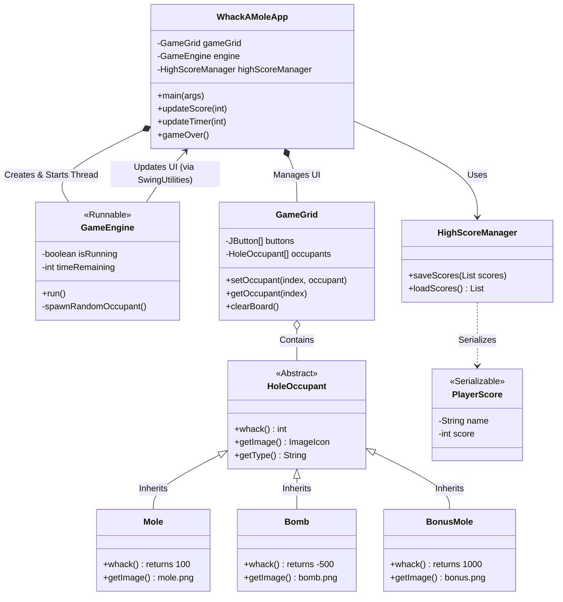

# 🔨 Whack-A-Mole (Java Capstone Project)

**An advanced, multi-threaded arcade game built with Java Swing, demonstrating core OOP principles, concurrency, and event-driven programming.**

[](https://www.oracle.com/java/)
[](https://docs.oracle.com/javase/tutorial/uiswing/)
[](LICENSE)
[]()

## 🚀 Overview

**Whack-A-Mole** is a fast-paced reflex game developed as a Capstone Project to demonstrate mastery of Java application development. Unlike simple script-based games, this project is engineered with a robust architecture featuring:

- **Multithreading:** A dedicated `GameEngine` thread manages game logic independently of the User Interface (UI) to prevent freezing.
- **Polymorphism:** Moles, Bombs, and Bonus items share a common abstract contract but behave differently when clicked.
- **Persistence:** High scores are serialized and saved locally, persisting between game sessions.
- **Robust Error Handling:** Custom checked and unchecked exceptions manage file I/O and game state integrity.

---

## 🏗️ Architecture & Class Design (UML)

The following UML Class Diagram illustrates the Object-Oriented structure of the application, highlighting the relationships between the UI, the Game Engine, and the polymorphic Game Objects.



## ✨ Key Features

### 🎯 Polymorphic Game Objects
The game uses an abstract HoleOccupant class. The game grid doesn't know what is in the hole, only that it can be "whacked."

Mole: Standard target (+100 Points).

Bomb: Penalty trap (-500 Points).

Bonus King: Rare high-value target (+1000 Points).

###⚡ Concurrency & Thread Safety
The game loop runs on a background thread (GameEngine), ensuring the GUI remains responsive.

SwingUtilities.invokeLater: All UI updates from the game thread are safely marshaled back to the Event Dispatch Thread (EDT).

### 💾 Data Persistence
High scores aren't lost when you close the game.

Uses ObjectOutputStream and ObjectInputStream to save player data to scores.dat.

Implements Serializable for the PlayerScore class.

### 🛡️ Exception Handling
- HighScoreException: A custom checked exception handling file I/O errors.

- InvalidGameStateException: A custom unchecked exception catching logic errors (e.g., accessing an invalid grid index).

```bash

WHACK-A-MOLE/
├── resources/                  # Game Assets (Images)
│   ├── bomb.png
│   ├── bonus.png
│   ├── empty.png
│   └── mole.png
├── src/
│   └── whackamole/             # Source Package
│       ├── WhackAMoleApp.java  # Main Entry Point & UI
│       ├── GameEngine.java     # Game Loop Logic
│       ├── GameGrid.java       # Grid Panel Logic
│       ├── HoleOccupant.java   # Abstract Base Class
│       ├── Mole.java           # Concrete Class
│       ├── Bomb.java           # Concrete Class
│       ├── BonusMole.java      # Concrete Class
│       ├── HighScoreManager.java
│       ├── PlayerScore.java
│       └── [Exception Classes]
└── scores.dat                  # Generated Save File

```